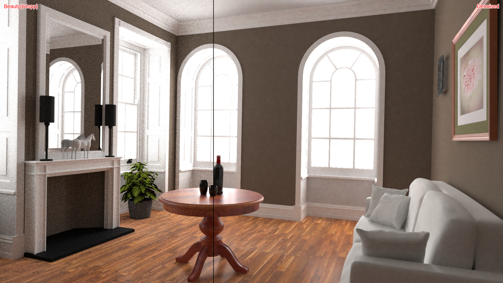

# rtcamp8-denoiser

[レイトレ合宿8](https://sites.google.com/view/raytracingcamp8/)のデノイズ部門用に作成したデノイザーです。



## Requirements

* C++ 17
* CUDA 11.7
* CMake 3.20

## Features

* Bilateral filter
* NL-Means filter
* A-trous filter
* Nonlinearly weighted first-order regression filter

## Build

```
mkdir build
cd build
cmake -DCMAKE_BUILD_TYPE=Release ..
make -j8
```

## Run

```
./main <filepath-to-color.hdr> <filepath-to-albedo.hdr> <filepath-to-normal.hdr>
```

## References

* [Dammertz, H., Sewtz, D., Hanika, J. and Lensch, H.P., 2010, June. Edge-avoiding a-trous wavelet transform for fast global illumination filtering. In Proceedings of the Conference on High Performance Graphics (pp. 67-75).](https://dl.acm.org/doi/10.5555/1921479.1921491)
* [Bitterli, B., Rousselle, F., Moon, B., Iglesias‐Guitián, J.A., Adler, D., Mitchell, K., Jarosz, W. and Novák, J., 2016, July. Nonlinearly weighted first‐order regression for denoising Monte Carlo renderings. In Computer Graphics Forum (Vol. 35, No. 4, pp. 107-117).](https://doi.org/10.1111/cgf.12954)
* [Schied, C., Kaplanyan, A., Wyman, C., Patney, A., Chaitanya, C.R.A., Burgess, J., Liu, S., Dachsbacher, C., Lefohn, A. and Salvi, M., 2017. Spatiotemporal variance-guided filtering: real-time reconstruction for path-traced global illumination. In Proceedings of High Performance Graphics (pp. 1-12).](https://doi.org/10.1145/3105762.3105770)